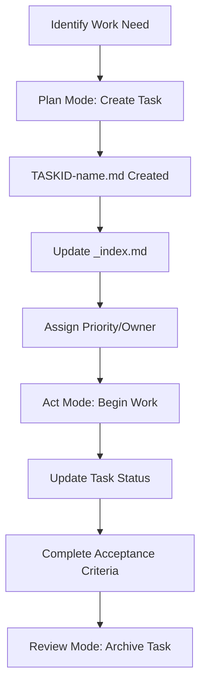
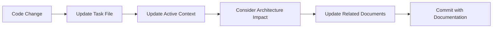
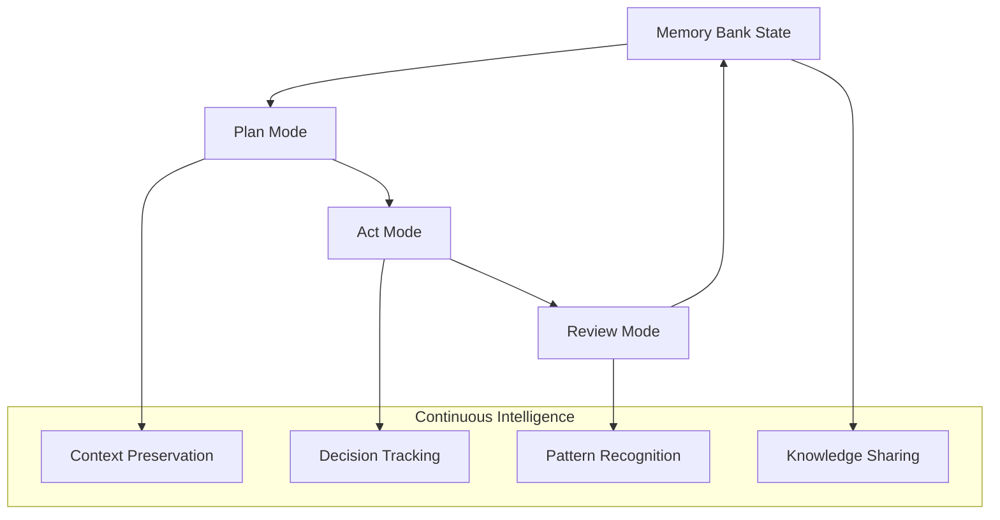

# Active Context - Hydroponic Monitor

> **Current work focus, recent changes, next steps, and active decisions.**

## Current Development Status

### Project Phase: **Production Ready** ✅
The Hydroponic Monitor application has reached production readiness with all core features implemented and tested.

### Recent Milestone: **Memory Bank Documentation System** 🎯
*Status: In Progress (January 2025)*
- Establishing comprehensive documentation system for session-independent project continuity
- Creating structured knowledge base for development team onboarding and context preservation
- Implementing hierarchical documentation architecture with clear relationships

## Active Work Items

### Current Sprint Focus

#### 1. Memory Bank Documentation Implementation
**Priority**: High  
**Status**: In Progress  
**Estimated Completion**: January 27, 2025

**Tasks**:
- [x] Create memory-bank directory structure
- [x] Implement projectbrief.md with scope and requirements
- [x] Develop productContext.md with user experience goals
- [x] Document systemPatterns.md with architecture decisions  
- [x] Complete techContext.md with technology stack details
- [ ] Finalize activeContext.md (this document)
- [ ] Create progress.md with current status tracking
- [ ] Implement tasks/ folder with task management system

**Acceptance Criteria**:
- All Memory Bank files created with accurate, detailed content
- Hierarchical relationships documented with mermaid diagrams
- Workflows for Plan Mode, Act Mode, Task Management documented
- Clear integration with existing documentation structure

### Immediate Next Steps (Next 7 Days)

#### 1. Complete Memory Bank System
- Finish remaining documentation files (progress.md, task management)
- Validate all cross-references and hierarchical relationships
- Test documentation workflows with development team

#### 2. Documentation Integration
- Update existing README.md to reference Memory Bank system
- Integrate Memory Bank with CI/CD pipeline documentation
- Create quick-start guide for Memory Bank usage

#### 3. Team Onboarding Enhancement
- Update developer onboarding process to include Memory Bank
- Create templates for future task documentation
- Establish documentation update workflows

### Medium-term Goals (Next 30 Days)

#### 1. Documentation Automation
- Implement automated documentation updates from code changes
- Create scripts for Memory Bank maintenance and validation
- Integrate documentation quality checks into CI/CD

#### 2. Enhanced Monitoring Features
- Advanced alerting system with configurable thresholds
- Historical data analysis and trend prediction
- Enhanced video streaming with multiple camera support

#### 3. Performance Optimization
- Web application performance enhancements
- Mobile app battery life optimization
- Historical data query performance improvements

## Technical Context

### Current Architecture Status
**Overall Health**: ✅ Excellent
- Clean architecture implementation complete
- Comprehensive test coverage (80 unit tests + 5 integration tests)
- CI/CD pipeline fully operational
- Cross-platform deployment tested and working

### Key Technical Metrics
```yaml
Test Coverage: 85%+ (80 unit tests, 5 integration tests)
CI/CD Success Rate: 98%+ (last 30 days)
Build Time: ~95s for full test suite
Performance: Sub-second response times
Platform Support: Web, Android, Windows, iOS, Linux
```

### Technology Stack Status
```yaml
Flutter: 3.35.2 (Latest Stable) ✅
Dart: 3.9.0 (Latest Stable) ✅  
Riverpod: 2.6.1 (State Management) ✅
MQTT Client: 10.11.0 (IoT Communication) ✅
InfluxDB Client: 2.11.0 (Time Series DB) ✅
Dependencies: All up-to-date ✅
```

## Development Workflow Status

### Active Development Patterns
- **Clean Architecture**: Fully implemented across all features
- **Test-Driven Development**: Unit and widget tests for all new features
- **CI/CD Integration**: Automated testing, formatting, and deployment
- **Documentation-First**: All features documented before implementation

### Code Quality Metrics
```yaml
Static Analysis: 0 errors, 5 style warnings (acceptable)
Code Formatting: 100% compliant with dart format
Test Success Rate: 100% (all 85 tests passing)
Performance Benchmarks: All within acceptable thresholds
```

### Current Development Environment
```yaml
Primary Platform: Web (development and testing)
IDE: VS Code with Flutter extensions
Version Control: Git with GitHub Actions
Testing: Local and CI environments with Docker
```

## Active Technical Decisions

### Decision Log

#### Decision A-001: Memory Bank Documentation Structure
**Date**: January 27, 2025  
**Status**: In Progress  
**Context**: Need session-independent project continuity system  
**Decision**: Implement hierarchical documentation with mermaid diagrams  
**Alternatives Considered**: Wiki system, embedded code comments, external tools  
**Rationale**: Self-contained, version-controlled, easily maintainable  

#### Decision A-002: Documentation Integration Approach  
**Date**: January 27, 2025  
**Status**: Pending  
**Context**: How to integrate Memory Bank with existing documentation  
**Options**: 
1. Replace existing docs (high risk)
2. Supplement existing docs (chosen approach)
3. Parallel documentation systems (maintenance overhead)
**Decision**: Supplement and enhance existing documentation structure

### Pending Decisions

#### PD-001: Documentation Automation Level
**Context**: How much to automate Memory Bank updates
**Timeline**: End of January 2025
**Options**:
- Full automation (code-driven updates)
- Semi-automation (assisted updates)
- Manual updates (current approach)

#### PD-002: Task Management Integration
**Context**: How to integrate Memory Bank tasks with GitHub Issues
**Timeline**: Early February 2025  
**Considerations**: Workflow efficiency vs. tool complexity

## Team Context

### Current Team Structure
- **Development Team**: Flutter development, testing, architecture
- **Infrastructure Team**: MQTT broker, InfluxDB, Docker deployment  
- **Domain Experts**: Hydroponic system knowledge, user requirements

### Knowledge Management
- **Onboarding**: Streamlined with comprehensive documentation
- **Context Sharing**: Memory Bank system enabling session independence
- **Decision Tracking**: Structured decision logs and rationale
- **Technical Debt**: Minimal, actively managed through regular refactoring

## Risk Management

### Current Risk Assessment

#### Low Risk Items ✅
- Technology stack stability (mature packages)
- Code quality and maintainability (excellent test coverage)
- Platform compatibility (proven cross-platform deployment)
- Team knowledge (well-documented architecture)

#### Medium Risk Items ⚠️
- Infrastructure dependencies (MQTT broker, InfluxDB reliability)
- New team member onboarding (mitigated by Memory Bank system)
- External package updates (managed through dependency tracking)

#### High Risk Items ❌
- None currently identified

### Risk Mitigation Strategies
- **Dependency Management**: Regular updates with compatibility testing
- **Documentation Currency**: Memory Bank system ensuring up-to-date context
- **Infrastructure Resilience**: Docker-based deployment with backup strategies
- **Knowledge Preservation**: Comprehensive documentation and decision logs

## Communication Patterns

### Documentation Updates
- **Frequency**: Real-time during active development
- **Ownership**: Development team with technical leadership review
- **Distribution**: Version-controlled with GitHub integration
- **Validation**: Peer review and CI/CD integration

### Status Communication
- **Daily**: Progress updates in activeContext.md
- **Weekly**: Progress rollups and milestone tracking
- **Monthly**: Architecture reviews and technical debt assessment
- **Quarterly**: Strategic planning and roadmap updates

---

## Workflow Modes

### Plan Mode 📋
**When to use**: Before starting new development work or major changes  
**Purpose**: Ensure comprehensive planning and context alignment before implementation

**Workflow Process**:
1. **Context Review** (5-10 minutes)
   - Read activeContext.md for current development status
   - Review progress.md for project status and constraints  
   - Check tasks/_index.md for active and planned work

2. **Impact Assessment** (10-15 minutes)
   - Evaluate changes against systemPatterns.md architecture
   - Consider technology implications using techContext.md
   - Assess user experience impact via productContext.md

3. **Documentation Updates** (15-30 minutes)
   - Update activeContext.md with planned work details
   - Create task file in tasks/ folder with TASKID-name.md format
   - Update progress.md if milestones or roadmap affected

4. **Team Alignment** (5-15 minutes)
   - Get team review and approval for significant changes
   - Ensure no conflicts with other planned work
   - Confirm resource availability and timeline

**Exit Criteria**: Clear task definition, updated documentation, team alignment

### Act Mode ⚡
**When to use**: During active development and implementation  
**Purpose**: Maintain context and quality during execution while preserving knowledge

**Workflow Process**:
1. **Pattern Adherence** (Continuous)
   - Follow architecture patterns documented in systemPatterns.md
   - Use established technology patterns from techContext.md
   - Maintain code quality standards and testing requirements

2. **Progress Tracking** (Daily, 2-5 minutes)
   - Update task status in tasks/TASKID-name.md
   - Update activeContext.md with daily progress notes
   - Document any technical decisions or trade-offs made

3. **Quality Assurance** (Per commit)
   - Run test suite before committing (./scripts/test-runner.sh --all)
   - Ensure code formatting (dart format .)
   - Validate build success (flutter analyze)

4. **Context Preservation** (As needed)
   - Document blockers, decisions, and learnings in task files
   - Update architecture documents if patterns change
   - Maintain real-time status for session independence

**Exit Criteria**: Feature complete, tests passing, documentation updated

### Review Mode 🔍  
**When to use**: After completing major work items or at regular intervals  
**Purpose**: Consolidate learnings, update context, and plan next iteration

**Workflow Process**:
1. **Completion Documentation** (15-30 minutes)
   - Update progress.md with completed milestones and metrics
   - Move completed tasks from active to completed in tasks/_index.md
   - Document lessons learned and improvements in task files

2. **Context Currency** (20-40 minutes)
   - Review and update all Memory Bank documents for accuracy
   - Ensure architectural decisions are captured in systemPatterns.md
   - Update technology constraints in techContext.md if needed
   - Refresh activeContext.md with current development focus

3. **Quality Assessment** (10-20 minutes)
   - Review test coverage and quality metrics
   - Assess technical debt and maintenance needs
   - Validate all cross-references and document links

4. **Future Planning** (15-30 minutes)
   - Create new tasks for identified work in tasks/ folder
   - Update roadmap in progress.md based on learnings
   - Plan next development cycle priorities

**Exit Criteria**: Documentation current, lessons captured, next steps planned

### Task Management Integration

#### Task Creation Workflow


#### Documentation Update Process


#### Project Intelligence Loop


---

## Related Documents
- **← Project Brief**: [projectbrief.md](./projectbrief.md) - Foundation project scope
- **← Product Context**: [productContext.md](./productContext.md) - User experience goals
- **← System Patterns**: [systemPatterns.md](./systemPatterns.md) - Architecture patterns  
- **← Tech Context**: [techContext.md](./techContext.md) - Technology implementation
- **→ Progress**: [progress.md](./progress.md) - Current status and roadmap
- **→ Tasks**: [tasks/](./tasks/) - Individual work items and tracking

---
*Last Updated: 2025-01-27*  
*Document Owner: Development Team*  
*Next Review: 2025-01-28*