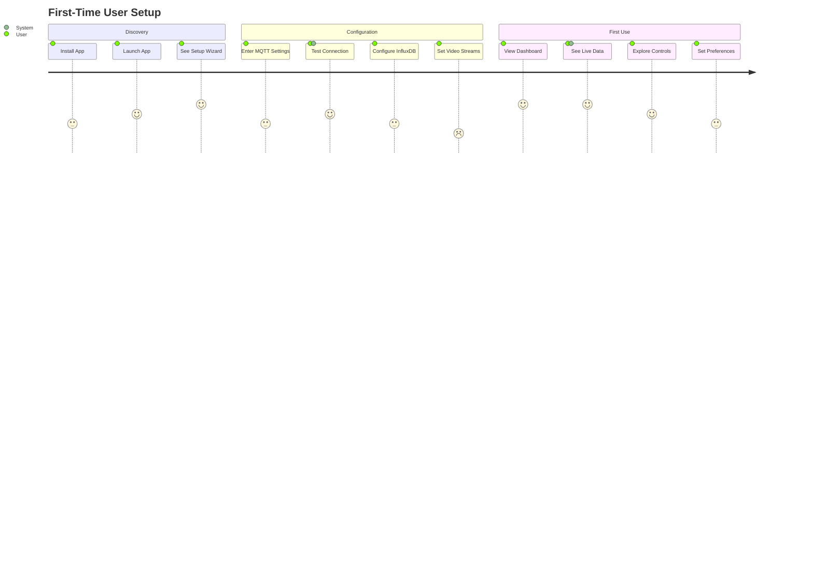
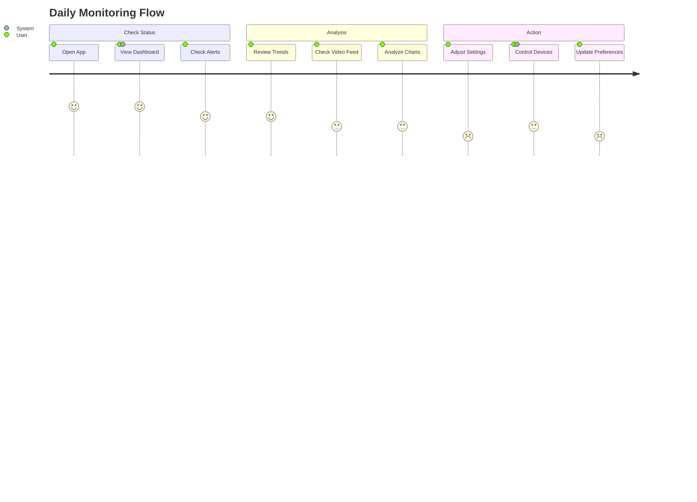

# Product Context - Hydroponic Monitor

> **Project purpose, user experience goals, and problems addressed.**

## Problem Statement

### Primary Problem
Hydroponic systems require continuous monitoring and control of multiple environmental parameters (water levels, temperature, humidity, pH, electrical conductivity) and actuators (pumps, fans, lighting, heating). Manual monitoring is time-intensive, error-prone, and prevents early detection of system issues that could damage crops or reduce yields.

### Current Pain Points
- **Manual Monitoring**: Requires physical presence to check sensor readings
- **Delayed Response**: Critical issues may go unnoticed for hours
- **Data Loss**: No historical tracking of environmental conditions
- **Control Complexity**: Managing multiple devices requires technical expertise
- **Accessibility**: System status not available when away from location
- **Integration Gaps**: Disparate sensors and controllers lack unified interface

## Target Users

### Primary Users

#### Home Hydroponic Enthusiasts
- **Profile**: Hobbyists and small-scale growers
- **Technical Level**: Basic to intermediate
- **Primary Needs**: Simple monitoring, alerts, historical trends
- **Usage Patterns**: Daily check-ins, occasional adjustments
- **Pain Points**: Technical setup complexity, data interpretation

#### Educational Institutions
- **Profile**: Schools, universities with agricultural programs
- **Technical Level**: Varies (students to researchers)
- **Primary Needs**: Educational visibility, data collection, experimentation
- **Usage Patterns**: Classroom demonstrations, research projects
- **Pain Points**: System setup, student accessibility

## User Experience Goals

### Core UX Principles

#### Simplicity First
- **Dashboard Clarity**: Key information visible at a glance
- **Minimal Cognitive Load**: Reduce decision fatigue
- **Progressive Disclosure**: Advanced features available but not prominent
- **Error Prevention**: Guide users away from harmful actions

#### Real-time Responsiveness
- **Immediate Feedback**: Actions reflect instantly in the UI
- **Live Updates**: Sensor data refreshes continuously
- **Status Visibility**: Clear connection and system health indicators
- **Performance**: Sub-second response times for all interactions

#### Cross-platform Consistency
- **Unified Experience**: Identical functionality across devices
- **Adaptive Design**: Optimized for each platform's strengths
- **State Synchronization**: Settings and preferences sync across devices
- **Offline Graceful**: Maintain functionality during connectivity issues

### User Journey Mapping

#### First-Time Setup Journey

#### Daily Monitoring Journey

### Experience Differentiators

#### Intelligent Dashboard
- **Smart Prioritization**: Most important information prominently displayed
- **Contextual Alerts**: Relevant warnings based on current conditions
- **Trend Indicators**: Visual cues for improving/degrading conditions
- **Quick Actions**: Common tasks accessible with minimal clicks

#### Unified Control Interface
- **Single Pane**: All system controls in one coherent interface
- **Confirmation Flow**: Clear feedback for control commands
- **Safety Mechanisms**: Prevent dangerous configuration combinations
- **Scheduling**: Time-based automation with visual feedback

#### Rich Historical Context
- **Multiple Timescales**: From minutes to months of historical data
- **Comparative Analysis**: Side-by-side period comparisons
- **Export Capabilities**: Data download for external analysis
- **Correlation Insights**: Relationship visualization between metrics

## Design Philosophy

### Material 3 Design System
- **Adaptive Theming**: Dynamic color schemes
- **8-Point Grid**: Consistent spatial relationships
- **Component Library**: Reusable, accessible UI elements
- **Motion Design**: Meaningful animations and transitions

### Information Architecture
- **Task-Oriented**: Organized around user goals, not system features
- **Hierarchical**: Clear navigation structure with logical groupings
- **Contextual**: Related information grouped and cross-linked
- **Searchable**: Quick access to specific sensors or controls

### Data Presentation
- **Visual First**: Charts and graphs preferred over raw numbers
- **Contextual Formatting**: Units, ranges, and thresholds clearly indicated
- **Status Coding**: Color, icons, and typography convey system state
- **Comparative**: Enable easy comparison across time periods and metrics

---

## Related Documents
- **← Project Brief**: [projectbrief.md](./projectbrief.md) - Overall project requirements
- **→ System Patterns**: [systemPatterns.md](./systemPatterns.md) - Technical architecture
- **→ Tech Context**: [techContext.md](./techContext.md) - Technology choices
- **→ Active Context**: [activeContext.md](./activeContext.md) - Current development focus

---
*Last Updated: 2025-09-06*