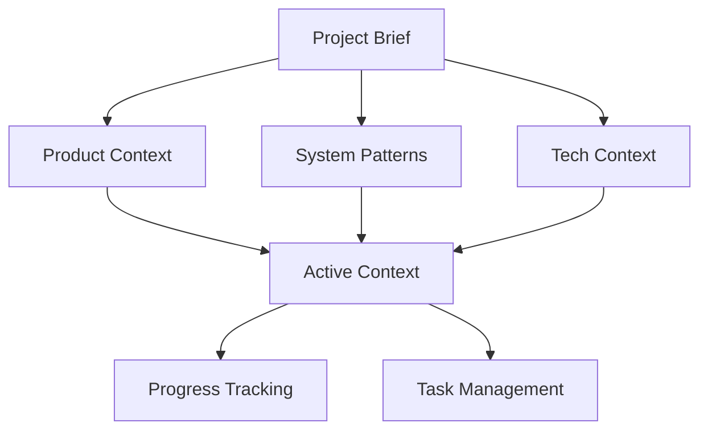

# Project Brief - Hydroponic Monitor

> **Foundation document for project requirements and goals. Source of truth for scope.**

## Project Overview

**Name**: Hydroponic Monitor 🌱  
**Version**: 1.0.0+1  
**Type**: Cross-platform Flutter application  
**Repository**: https://github.com/BBowdon00/Hydroponic_Monitor

### Mission Statement
Build a comprehensive, cross-platform Flutter application to monitor and control hydroponic systems with real-time sensors, device controls, video feed, historical charts, and MQTT integration. Provide an intuitive dashboard for tracking water levels, temperature, humidity, pH, and electrical conductivity while enabling remote control of pumps, fans, lighting, and heating systems.

## Target Platforms
- **Web**
- **Android**
- Later, iOS support

## Core Requirements

### Functional Requirements

#### Real-time Monitoring
- **Dashboard**: Live sensor readings with trend indicators
- **Sensor Types**: Water level, temperature, humidity, pH, electrical conductivity, light intensity, power usage
- **Data Sources**: ESP32 microcontrollers, Raspberry Pi nodes through MQTT messages
- **Update Frequency**: Real-time via MQTT streaming

#### Device Control
- **Actuators**: Water pumps, circulation fans, LED grow lights
- **Control Types**: On/off,  scheduling (later)
- **Feedback Loop**: Command confirmation and state verification
- **Safety**: Timeout handling, retry logic, error reporting

#### Video Integration
- **Live Feed**: MJPEG stream viewing from Raspberry Pi cameras
- **Connection Management**: Stream health monitoring and reconnection
- **Multi-camera**: Support for multiple video sources

#### Historical Analytics
- **Time-series Charts**: Customizable ranges (1h, 24h, 7d, 30d)
- **Data Source**: InfluxDB time-series database
- **Aggregation**: Multiple aggregation functions for different time scales
- **Export**: Data visualization and trend analysis

#### System Management
- **Configuration**: MQTT, InfluxDB, video streams, app preferences
- **Connectivity**: Connection status and offline handling
- **Settings**: User preferences, theme selection, notification settings

### Technical Requirements

#### Performance
- **Response Time**: < 100ms for UI interactions
- **Data Latency**: Near real-time sensor updates (< 5s)
- **Memory Usage**: Efficient for mobile devices

#### Reliability
- **Uptime**: 99.9% application availability
- **Error Handling**: Graceful degradation during connectivity issues
- **Data Integrity**: No loss of sensor readings or control commands
- **Recovery**: Automatic reconnection and state synchronization

#### Security
- **Authentication**: MQTT broker authentication
- **Access Control**: Device-specific permissions

#### Scalability
- **Multi-node**: Support for multiple ESP32/Raspberry Pi nodes
- **Sensor Expansion**: Easy addition of new sensor types
- **Device Growth**: Scalable actuator management
- **Data Volume**: Efficient handling of historical data

## Success Criteria

### User Experience
- **Intuitive Interface**: Easy navigation for non-technical users
- **Responsive Design**: Consistent experience across all platforms
- **Performance**: Smooth animations and interactions

### System Integration
- **MQTT Reliability**: 99.9% message delivery success
- **Database Performance**: Sub-second query response times
- **Video Streaming**: < 2s stream startup time
- **Cross-platform**: Identical functionality on all supported platforms

### Operational Excellence
- **Monitoring**: Comprehensive application and system monitoring
- **Deployment**: Automated CI/CD pipeline
- **Maintenance**: Easy updates and configuration changes
- **Documentation**: Complete technical and user documentation

## Constraints and Assumptions

### Technical Constraints
- **Flutter Version**: 3.35.2+ with Dart 3.9.0+
- **Network**: Reliable WiFi/internet connectivity required
- **Hardware**: ESP32/Raspberry Pi infrastructure dependencies
- **Browser**: Modern browsers with WASM support for web deployment

### Business Constraints
- **Budget**: Open source project with minimal external costs
- **Timeline**: Iterative development with MVP approach
- **Resources**: Limited to development team availability

### Assumptions
- **Infrastructure**: Pre-existing MQTT broker and InfluxDB setup
- **Hardware**: Functioning ESP32/Raspberry Pi sensor network
- **Network**: Stable local network connectivity
- **Users**: Basic technical knowledge for initial setup

## Project Hierarchy

## Related Documents
- **Product Context**: [productContext.md](./productContext.md) - User experience and problem definition
- **System Patterns**: [systemPatterns.md](./systemPatterns.md) - Architecture and design decisions
- **Tech Context**: [techContext.md](./techContext.md) - Technology stack and constraints
- **Active Context**: [activeContext.md](./activeContext.md) - Current development focus
- **Progress**: [progress.md](./progress.md) - Implementation status and roadmap
- **Testing Procedure**: [testing-procedure.md](./testing-procedure.md) - Canonical testing workflow & completion criteria

---
*Last Updated: 2025-09-24*  