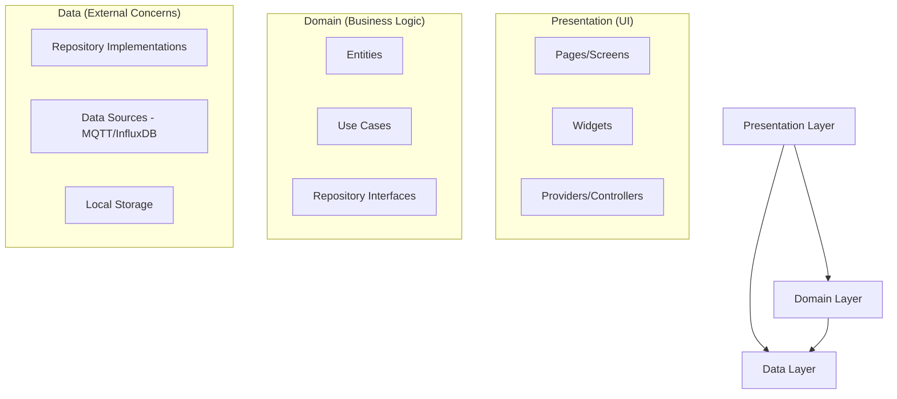
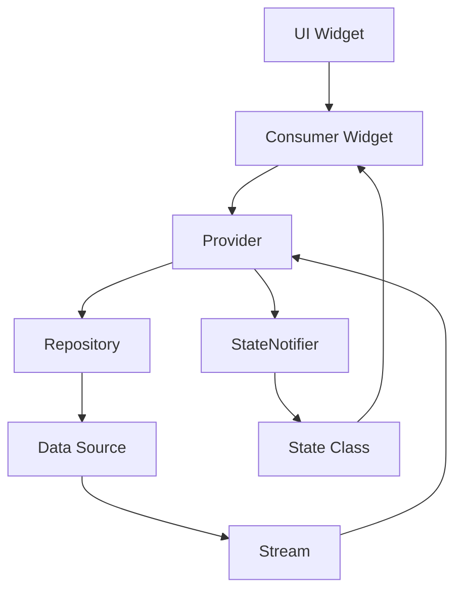
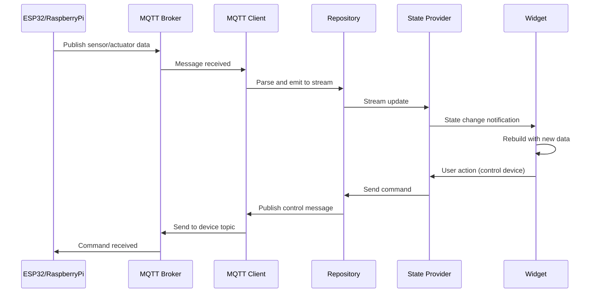
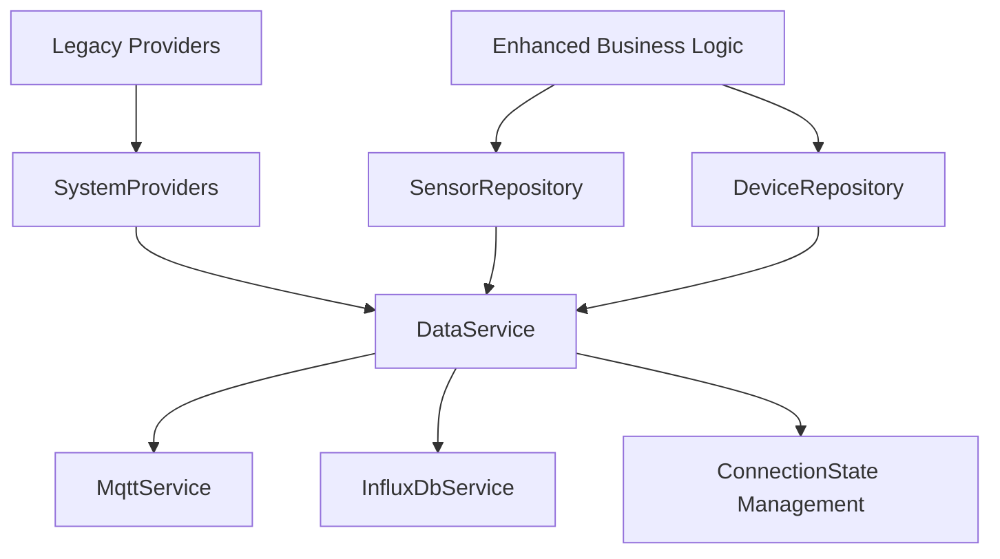
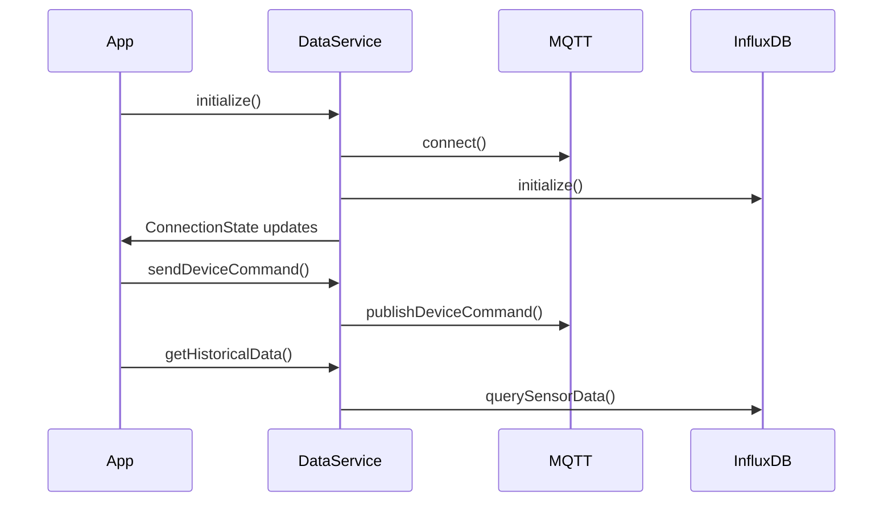
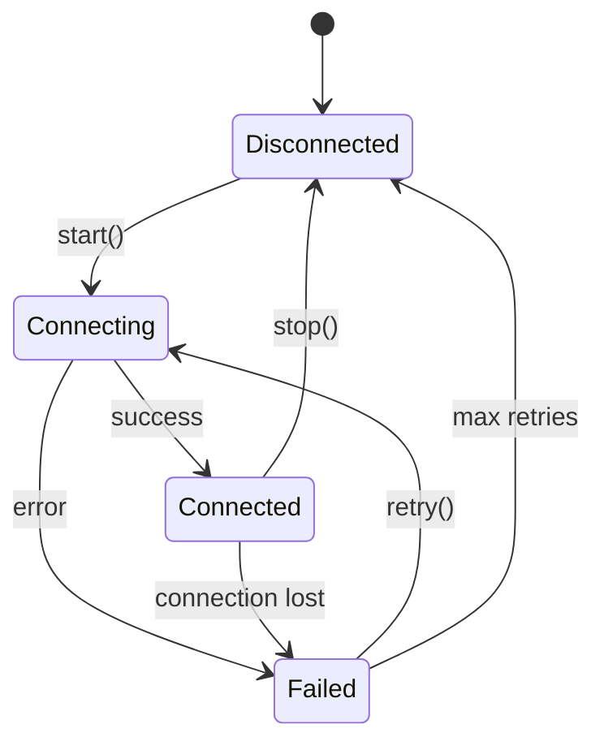

# System Patterns - Hydroponic Monitor

> **System architecture, design patterns, and technical decisions.**

## Architecture Overview

The Hydroponic Monitor follows **Clean Architecture** principles with a **feature-first organization** approach, ensuring maintainability, testability, and platform independence.

### Core Architecture Principles

#### Clean Architecture Layers


#### Dependency Direction
- **Inward Dependencies**: All dependencies point inward toward the domain
- **Interface Segregation**: Domain defines interfaces, data layer implements them
- **Inversion of Control**: High-level modules don't depend on low-level modules

### Directory Structure Pattern

```
lib/
├── core/                    # Shared utilities and infrastructure
│   ├── constants/          # App-wide constants and configurations
│   ├── env.dart           # Environment configuration management
│   ├── errors.dart        # Error types and exception handling
│   ├── logger.dart        # Structured logging utilities
│   └── theme.dart         # Material 3 theming and design 
├── data/                   # Data layer implementations
│   ├── influx/            # InfluxDB client and data source
│   ├── mqtt/              # MQTT client and message handling
│   └── repos/             # Repository implementations
├── domain/                 # Business logic and entities
│   ├── entities/          # Domain models and value objects
│   └── usecases/          # Business operations and rules
└── presentation/           # UI layer and user interactions
    ├── app.dart           # App configuration and setup
    ├── routes.dart        # Navigation and routing configuration
    ├── pages/             # Screen implementations
    ├── providers/         # State management with Riverpod
    └── widgets/           # Reusable UI components
```

## Design Patterns

### State Management Pattern

#### Riverpod Provider Architecture


**Key Components:**
- **StateNotifierProvider**: Manages mutable state with business logic
- **StreamProvider**: Exposes reactive data streams from repositories
- **FutureProvider**: Handles asynchronous operations and caching
- **Provider**: Simple dependency injection for services


### Event-Driven Architecture

#### MQTT Message Flow Pattern


## Architectural Decisions

### Decision 1: Flutter + Riverpod for State Management

**Context**: Need cross-platform app with reactive state management  
**Decision**: Use Flutter with Riverpod for state management  
**Rationale**: 
- Flutter provides native performance across all target platforms
- Riverpod offers compile-time safety, testability, and reactive programming
- Strong community support and active development

**Consequences**:
- ✅ Single codebase for all platforms
- ✅ Type-safe state management
- ❌ Learning curve for Riverpod patterns

### Decision 2: MQTT for Real-time Communication

**Context**: Need real-time sensor data and device control  
**Decision**: Use MQTT protocol with mqtt_client package  
**Rationale**:
- Industry standard for IoT communication
- Lightweight and efficient for resource-constrained devices
- Built-in quality of service and reliability features

**Consequences**:
- ✅ Reliable real-time data flow
- ✅ Scalable to many devices
- ❌ Requires MQTT broker infrastructure

### Decision 3: InfluxDB for Time-Series Data

**Context**: Need efficient storage and querying of historical sensor data  
**Decision**: Use InfluxDB with influxdb_client package  
**Rationale**:
- Purpose-built for time-series data
- Efficient compression and query performance  
- Rich query language (Flux) with aggregation functions

**Consequences**:
- ✅ Excellent performance for time-series queries
- ✅ Built-in downsampling and retention policies
- ❌ Additional infrastructure component

### Decision 4: Clean Architecture with Feature-First Organization

**Context**: Need maintainable, testable codebase that can grow  
**Decision**: Implement clean architecture with feature-first directory structure  
**Rationale**:
- Clear separation of concerns
- Testable business logic isolated from UI and data layers
- Features grouped logically for team collaboration

**Consequences**:
- ✅ Highly maintainable and testable code
- ✅ Clear boundaries and responsibilities
- ❌ Initial complexity and boilerplate

### Decision 5: Unified DataService Architecture (2025)

**Context**: Original architecture had redundant connection monitoring and complex provider initialization  
**Decision**: Create unified DataService to orchestrate all data sources and simplify provider architecture  
**Rationale**:
- Eliminate duplicate connection status tracking
- Centralize service initialization and error handling
- Improve separation of concerns between presentation and data layers
- Add business logic validation in repositories

**Consequences**:
- ✅ Simplified connection management with single source of truth
- ✅ Enhanced repository pattern with business logic and validation
- ✅ Reduced code duplication and complexity
- ✅ Better error handling and service coordination
- ✅ Maintained backward compatibility with existing code

**Implementation**:


**Files Created/Modified**:
- `lib/data/services/data_service.dart` - New unified service orchestration
- `lib/presentation/providers/system_providers.dart` - New simplified provider architecture
- Enhanced `SensorRepository` and `DeviceRepository` with business logic
- Updated `ConnectionStatusProvider` to use unified connection state

## Integration Patterns

### Repository Pattern (Enhanced 2025)

The repository pattern has been enhanced to include business logic and validation rather than simple pass-through functionality:

#### SensorRepository Features:
- **Data Validation**: Range checking for sensor values based on sensor type
- **Caching**: Latest readings by sensor type for quick access
- **Business Logic**: Average value calculations, health checks
- **Stream Processing**: Real-time data processing with error handling

#### DeviceRepository Features:
- **Command Validation**: Validates device commands based on device type and parameters
- **Device Health Monitoring**: Tracks device responsiveness and status
- **Business Rules**: Applies device-specific logic and timeout handling
- **State Management**: Maintains device state cache with status tracking

### Service Orchestration Pattern

The DataService pattern centralizes all data source management:



### MQTT Integration Pattern

#### Topic Structure
```
grow/{node}/{device|actuator|sensor}
grow/{node}/actuator/set
grow/{node}/status
```
**Sensor Data Messages** (e.g., `grow/rpi/sensor`):
```json
{
   "deviceType": "temperature",
   "deviceID": "1", 
   "location": "tent",
   "value": "23.22",
   "description": "under light"
}
```

**Actuator Status Messages** (e.g., `grow/rpi/actuator`):
```json
{
   "deviceType": "pump",
   "deviceID": "2",
   "location": "tent", 
   "running": true,
   "description": "main circulation"
}
```

**Device Health Messages** (e.g., `grow/esp32_1/device`):
```json
{
   "deviceType": "microcontroller",
   "deviceID": "1",
   "location": "tent",
   "running": false,
   "description": "esp32 board on floor"
}
```
**Actuator Action Request** (e.g. `grow/rpi_2/actuator/set`)
```json
{
   "deviceType": "fan",
   "deviceID":"3",
   "location":"tent",
   "requestID": "phone",
   "reason": "manual", // automatic, or kill switch
   "duration": "-", //duration of "-" = infinite (until turned off/on). In seconds
   "action": "on", // "on", "off", or "toggle"
}
```

#### Dashboard/Display Integration for Sensor Data
Each tile will display the latest sensor information. It will wait for MQTT messages and update as they are received. If no message has been received yet, the display should indicate it is waiting for a new message. Each tile will be hold data for unique deviceID+deviceType+node. I.e. one tile will be displaying data from deviceType="temperature", deviceID="1", and node="rpi". Another tile will display for deviceType="humidity", deviceID="1", and node="esp32" and et cetera. Currently, there is only one sensor per sensorType, so device ID should always be 1. 

### InfluxDB Time-Series Database

InfluxDB stores historical sensor data and device states for analytics and charting. The data is organized using InfluxDB's tag-based structure:

- **Measurement**: sensor, device, or actuator
- **Tags**: Indexed metadata with the following tags: location, deviceType, deviceID, deviceNode,project
- **Fields**: Actual values (sensor readings, boolean states)
- **Timestamp**: Precise time of measurement

This structure enables efficient querying for historical charts with customizable time ranges (1h, 24h, 7d, 30d) and aggregation functions.

### Actuator Control Flow

The app **will** implement a robust control system for managing actuators:

1. **Command Publishing**: App publishes control messages to device-specific topics (e.g., `grow/esp32_1/actuator/set`)
2. **Device Processing**: Target device receives command and attempts state change
3. **State Confirmation**: Device publishes actual state via status messages
4. **Monitoring Loop**: App monitors for confirmation within timeout period
5. **Failure Handling**: Retry logic and error reporting for failed commands

This architecture ensures reliable control with feedback verification, preventing assumptions about successful state changes and providing visibility into system responsiveness.

### Video Streaming Pattern

#### MJPEG Stream Handler


## Performance Patterns

### Stream Management
- **Stream Controllers**: Properly managed with dispose() calls
- **Stream Subscriptions**: Cancelled to prevent memory leaks
- **Backpressure Handling**: Buffer limits and overflow strategies

### Memory Management
- **Widget Disposal**: Proper cleanup of resources in dispose()
- **Cache Strategies**: LRU cache for historical data
- **Image Management**: Efficient handling of video frames

### Battery Optimization
- **Background Processing**: Minimize work when app is backgrounded
- **Network Efficiency**: Batch requests and compress data
- **CPU Usage**: Efficient algorithms and minimal rebuilds

---

## Related Documents
- **← Project Brief**: [projectbrief.md](./projectbrief.md) - Project scope and requirements
- **← Product Context**: [productContext.md](./productContext.md) - User experience goals
- **→ Tech Context**: [techContext.md](./techContext.md) - Technology implementation details
- **→ Active Context**: [activeContext.md](./activeContext.md) - Current implementation status

---
*Last Updated: 2025-01-27*  