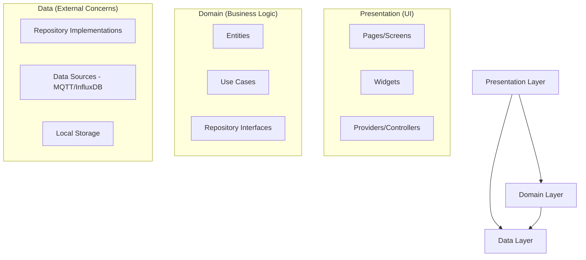
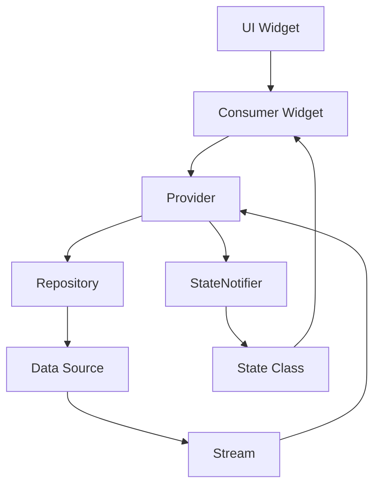
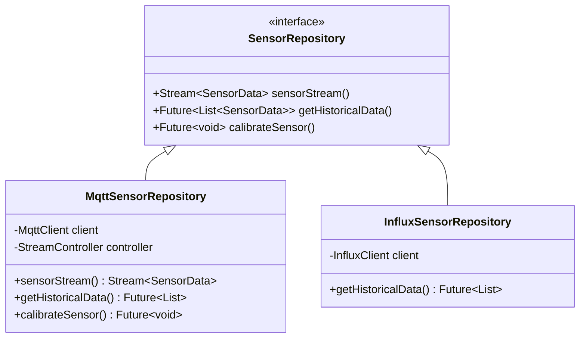
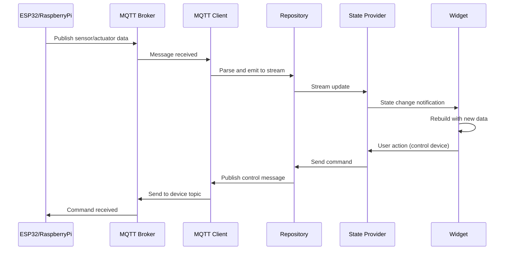
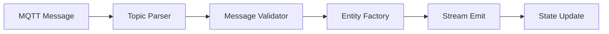
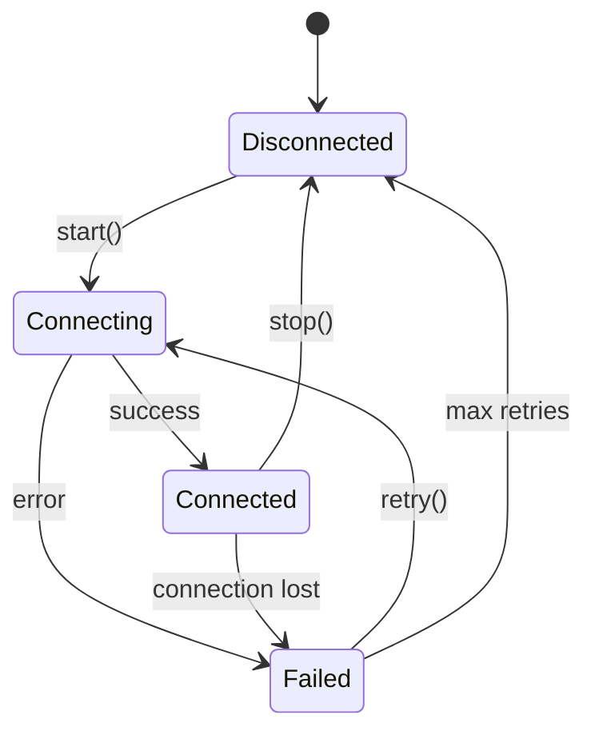

# System Patterns - Hydroponic Monitor

> **System architecture, design patterns, and technical decisions.**

## Architecture Overview

The Hydroponic Monitor follows **Clean Architecture** principles with a **feature-first organization** approach, ensuring maintainability, testability, and platform independence.

### Core Architecture Principles

#### Clean Architecture Layers


#### Dependency Direction
- **Inward Dependencies**: All dependencies point inward toward the domain
- **Interface Segregation**: Domain defines interfaces, data layer implements them
- **Inversion of Control**: High-level modules don't depend on low-level modules

### Directory Structure Pattern

```
lib/
├── core/                    # Shared utilities and infrastructure
│   ├── constants/          # App-wide constants and configurations
│   ├── env.dart           # Environment configuration management
│   ├── errors.dart        # Error types and exception handling
│   ├── logger.dart        # Structured logging utilities
│   └── theme.dart         # Material 3 theming and design tokens
├── data/                   # Data layer implementations
│   ├── influx/            # InfluxDB client and data source
│   ├── mqtt/              # MQTT client and message handling
│   └── repos/             # Repository implementations
├── domain/                 # Business logic and entities
│   ├── entities/          # Domain models and value objects
│   └── usecases/          # Business operations and rules
└── presentation/           # UI layer and user interactions
    ├── app.dart           # App configuration and setup
    ├── routes.dart        # Navigation and routing configuration
    ├── pages/             # Screen implementations
    ├── providers/         # State management with Riverpod
    └── widgets/           # Reusable UI components
```

## Design Patterns

### State Management Pattern

#### Riverpod Provider Architecture


**Key Components:**
- **StateNotifierProvider**: Manages mutable state with business logic
- **StreamProvider**: Exposes reactive data streams from repositories
- **FutureProvider**: Handles asynchronous operations and caching
- **Provider**: Simple dependency injection for services

#### Example Pattern Implementation
```dart
// State class (immutable)
@freezed
class SensorState with _$SensorState {
  const factory SensorState({
    @Default([]) List<SensorData> sensors,
    @Default(false) bool isLoading,
    String? error,
  }) = _SensorState;
}

// StateNotifier (business logic)
class SensorController extends StateNotifier<SensorState> {
  final SensorRepository _repository;
  
  SensorController(this._repository) : super(const SensorState());
  
  void loadSensors() async {
    state = state.copyWith(isLoading: true);
    try {
      final sensors = await _repository.getAllSensors();
      state = state.copyWith(sensors: sensors, isLoading: false);
    } catch (e) {
      state = state.copyWith(error: e.toString(), isLoading: false);
    }
  }
}

// Provider definition
final sensorControllerProvider = StateNotifierProvider<SensorController, SensorState>(
  (ref) => SensorController(ref.read(sensorRepositoryProvider)),
);
```

### Repository Pattern

#### Data Access Abstraction


**Benefits:**
- **Testability**: Easy to mock for unit tests
- **Flexibility**: Swap data sources without affecting business logic
- **Separation of Concerns**: UI doesn't know about data source implementation

### Event-Driven Architecture

#### MQTT Message Flow Pattern


### Error Handling Pattern

#### Result Type Pattern
```dart
// Result type for error handling
sealed class Result<T, E> {
  const Result();
}

class Success<T, E> extends Result<T, E> {
  const Success(this.value);
  final T value;
}

class Failure<T, E> extends Result<T, E> {
  const Failure(this.error);
  final E error;
}

// Usage in repository
Future<Result<List<SensorData>, SensorError>> getAllSensors() async {
  try {
    final sensors = await _fetchSensorsFromMqtt();
    return Success(sensors);
  } on MqttException catch (e) {
    return Failure(SensorError.connectionFailed(e.message));
  } on FormatException catch (e) {
    return Failure(SensorError.invalidData(e.message));
  }
}
```

## Architectural Decisions

### Decision 1: Flutter + Riverpod for State Management

**Context**: Need cross-platform app with reactive state management  
**Decision**: Use Flutter with Riverpod for state management  
**Rationale**: 
- Flutter provides native performance across all target platforms
- Riverpod offers compile-time safety, testability, and reactive programming
- Strong community support and active development

**Consequences**:
- ✅ Single codebase for all platforms
- ✅ Type-safe state management
- ❌ Learning curve for Riverpod patterns

### Decision 2: MQTT for Real-time Communication

**Context**: Need real-time sensor data and device control  
**Decision**: Use MQTT protocol with mqtt_client package  
**Rationale**:
- Industry standard for IoT communication
- Lightweight and efficient for resource-constrained devices
- Built-in quality of service and reliability features

**Consequences**:
- ✅ Reliable real-time data flow
- ✅ Scalable to many devices
- ❌ Requires MQTT broker infrastructure

### Decision 3: InfluxDB for Time-Series Data

**Context**: Need efficient storage and querying of historical sensor data  
**Decision**: Use InfluxDB with influxdb_client package  
**Rationale**:
- Purpose-built for time-series data
- Efficient compression and query performance  
- Rich query language (Flux) with aggregation functions

**Consequences**:
- ✅ Excellent performance for time-series queries
- ✅ Built-in downsampling and retention policies
- ❌ Additional infrastructure component

### Decision 4: Clean Architecture with Feature-First Organization

**Context**: Need maintainable, testable codebase that can grow  
**Decision**: Implement clean architecture with feature-first directory structure  
**Rationale**:
- Clear separation of concerns
- Testable business logic isolated from UI and data layers
- Features grouped logically for team collaboration

**Consequences**:
- ✅ Highly maintainable and testable code
- ✅ Clear boundaries and responsibilities
- ❌ Initial complexity and boilerplate

## Integration Patterns

### MQTT Integration Pattern

#### Topic Structure
```
grow/{node}/{category}/{type}/{id}/state
grow/{node}/{category}/{type}/{id}/set
grow/{node}/status
```

#### Message Processing Pipeline


### InfluxDB Integration Pattern

#### Query Builder Pattern
```dart
class InfluxQueryBuilder {
  String _bucket = '';
  String _measurement = '';
  List<String> _filters = [];
  String _range = '';
  
  InfluxQueryBuilder from(String bucket) {
    _bucket = bucket;
    return this;
  }
  
  InfluxQueryBuilder measurement(String measurement) {
    _measurement = measurement;
    return this;
  }
  
  InfluxQueryBuilder where(String field, String operator, String value) {
    _filters.add('r["$field"] $operator "$value"');
    return this;
  }
  
  InfluxQueryBuilder range(String range) {
    _range = range;
    return this;
  }
  
  String build() {
    return '''
      from(bucket: "$_bucket")
        |> range(start: $_range)
        |> filter(fn: (r) => r["_measurement"] == "$_measurement")
        ${_filters.map((f) => '|> filter(fn: (r) => $f)').join('\n')}
    ''';
  }
}
```

### Video Streaming Pattern

#### MJPEG Stream Handler


## Performance Patterns

### Stream Management
- **Stream Controllers**: Properly managed with dispose() calls
- **Stream Subscriptions**: Cancelled to prevent memory leaks
- **Backpressure Handling**: Buffer limits and overflow strategies

### Memory Management
- **Widget Disposal**: Proper cleanup of resources in dispose()
- **Cache Strategies**: LRU cache for historical data
- **Image Management**: Efficient handling of video frames

### Battery Optimization
- **Background Processing**: Minimize work when app is backgrounded
- **Network Efficiency**: Batch requests and compress data
- **CPU Usage**: Efficient algorithms and minimal rebuilds

---

## Related Documents
- **← Project Brief**: [projectbrief.md](./projectbrief.md) - Project scope and requirements
- **← Product Context**: [productContext.md](./productContext.md) - User experience goals
- **→ Tech Context**: [techContext.md](./techContext.md) - Technology implementation details
- **→ Active Context**: [activeContext.md](./activeContext.md) - Current implementation status

---
*Last Updated: 2025-01-27*  
*Document Owner: Architecture Team*