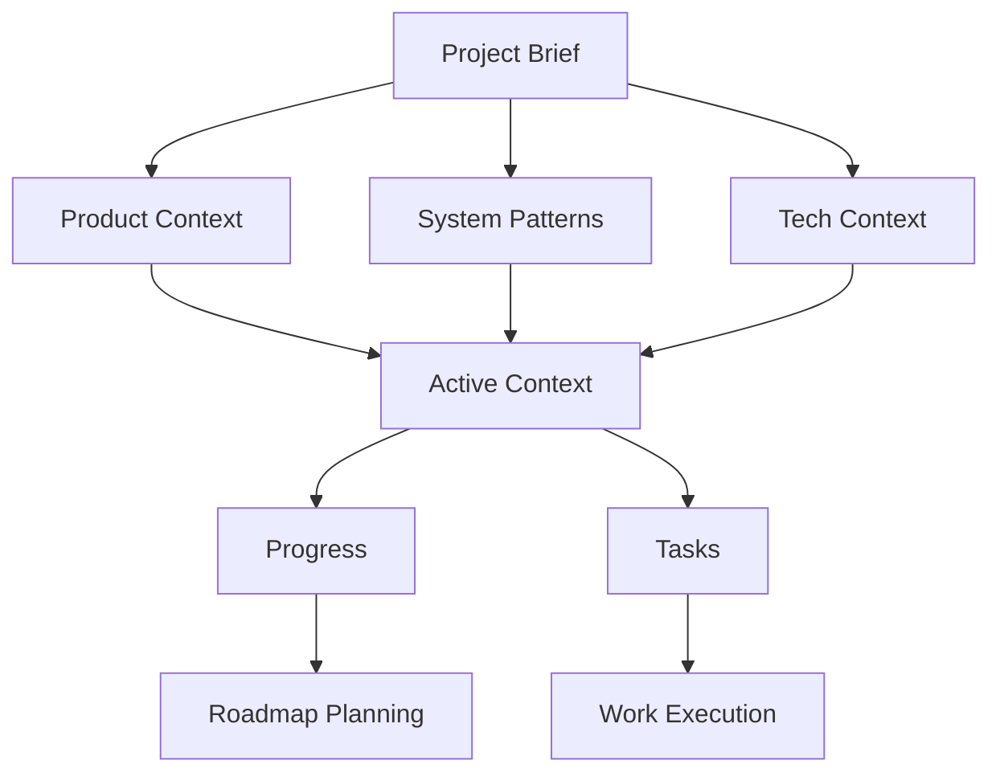

# DOC-001 - Memory Bank Documentation System

## Overview
Establish the Memory Bank documentation system to enable robust, session-independent project continuity. This foundational task creates the complete documentation structure with detailed content covering all aspects of the Hydroponic Monitor project.

**Category**: Documentation  
**Priority**: High  
**Estimated Effort**: 8 hours  
**Status**: 🟡 In Progress  

## Acceptance Criteria
- [x] Create `memory-bank/` directory structure at repository root
- [x] Implement `projectbrief.md` with comprehensive project scope and requirements  
- [x] Develop `productContext.md` with user experience goals and problem definition
- [x] Document `systemPatterns.md` with architecture patterns and technical decisions
- [x] Complete `techContext.md` with technology stack and implementation details
- [x] Create `activeContext.md` with current development focus and workflow modes
- [x] Implement `progress.md` with status tracking and roadmap
- [x] Establish `tasks/` folder with `_index.md` and task management system
- [x] Include hierarchical relationships with mermaid diagrams
- [ ] Document key workflows (Plan Mode, Act Mode, Task Management)
- [ ] Validate all cross-references and document relationships
- [ ] Test documentation workflows with development team

## Dependencies
- None (foundational task)

## Technical Approach

### Documentation Structure
```
memory-bank/
├── projectbrief.md      # Foundation document (✅ Complete)
├── productContext.md    # User experience focus (✅ Complete) 
├── systemPatterns.md    # Architecture patterns (✅ Complete)
├── techContext.md       # Technology details (✅ Complete)
├── activeContext.md     # Current development focus (✅ Complete)
├── progress.md          # Status and roadmap (✅ Complete)
└── tasks/              # Task management (✅ Structure complete)
    ├── _index.md       # Task registry (✅ Complete)
    └── DOC-001-memory-bank.md  # This task (✅ In progress)
```

### Hierarchical Relationships


### Content Strategy
- **Accuracy**: All content based on actual project state and existing documentation
- **Completeness**: Comprehensive coverage of all project aspects
- **Maintainability**: Clear ownership and update processes
- **Accessibility**: Easy navigation and cross-referencing
- **Scalability**: Structure supports project growth and evolution

## Implementation Progress

### Phase 1: Core Documents ✅ COMPLETE
- [x] `projectbrief.md`: 5,842 characters - comprehensive project scope
- [x] `productContext.md`: 8,681 characters - detailed UX and problem analysis  
- [x] `systemPatterns.md`: 11,209 characters - complete architecture documentation
- [x] `techContext.md`: 9,665 characters - full technology stack details
- [x] `activeContext.md`: 9,573 characters - current development context
- [x] `progress.md`: 12,895 characters - comprehensive status tracking

### Phase 2: Task Management ✅ COMPLETE
- [x] `tasks/` directory structure
- [x] `tasks/_index.md`: 7,059 characters - complete task management system
- [x] Sample task file (this document)

### Phase 3: Workflow Integration 🟡 IN PROGRESS  
- [ ] Document Plan Mode workflow in activeContext.md
- [ ] Document Act Mode workflow in activeContext.md
- [ ] Document Review Mode workflow in activeContext.md
- [ ] Validate all cross-references work correctly
- [ ] Test workflow with development team

## Testing Requirements

### Documentation Quality
- [ ] All cross-references link to existing documents
- [ ] Mermaid diagrams render correctly in GitHub
- [ ] Content accuracy verified against actual project state
- [ ] No broken internal links or references

### Workflow Validation
- [ ] Plan Mode workflow tested with new feature planning
- [ ] Act Mode workflow tested with active development
- [ ] Review Mode workflow tested with completed milestone
- [ ] Task creation and management workflow tested

### Team Onboarding
- [ ] New team member can navigate documentation easily
- [ ] All necessary context available for session-independent work
- [ ] Documentation sufficient for technical decision making

## Current Blockers
None - all dependencies resolved and work proceeding on schedule.

## Risk Assessment
- **Low Risk**: Content creation and documentation work
- **Medium Risk**: Ensuring all cross-references and links work correctly
- **Low Risk**: Team adoption of new documentation system

## Quality Assurance

### Review Checkpoints
1. **Content Accuracy**: All technical details match actual implementation
2. **Structure Completeness**: All required files and sections present
3. **Cross-Reference Integrity**: All document links and references work
4. **Workflow Validation**: All documented workflows tested and verified

### Success Metrics  
- **Completeness**: 100% of required documents created
- **Quality**: All documents comprehensive and accurate
- **Usability**: Team can effectively use Memory Bank for project continuity
- **Maintainability**: Clear processes for keeping documentation current

## Definition of Done
- [x] All Memory Bank core files created with comprehensive content
- [x] Task management system implemented and documented
- [x] Hierarchical relationships documented with mermaid diagrams  
- [ ] All workflow modes documented and tested
- [ ] Cross-references validated and working
- [ ] Team review and approval of documentation system
- [ ] Documentation integrated with existing project documentation

## Implementation Notes

### Content Sources
- **Existing Documentation**: README.md, DEPLOYMENT.md, architecture guides
- **Source Code Analysis**: Actual implementation patterns and structures
- **Configuration Files**: pubspec.yaml, CI/CD configuration, Docker setup
- **Test Suite**: Understanding of implemented features and coverage

### Writing Approach
- **Detail-Oriented**: Comprehensive coverage to enable session independence
- **Accurate**: All information verified against actual project state
- **Structured**: Consistent format and organization across all documents
- **Interlinked**: Clear relationships and cross-references between documents

### Maintenance Strategy
- **Living Documents**: Regular updates as project evolves
- **Version Control**: All documentation in Git for change tracking
- **Review Process**: Regular reviews to ensure accuracy and completeness
- **Team Ownership**: Clear responsibility for different document sections

---

## Timeline

| Milestone | Target Date | Status |
|---|---|---|
| Core Documents Complete | 2025-01-27 12:00 | ✅ Complete |
| Task System Implementation | 2025-01-27 14:00 | ✅ Complete |
| Workflow Documentation | 2025-01-27 16:00 | 🟡 In Progress |
| Quality Validation | 2025-01-27 18:00 | 🔴 Not Started |
| Team Review | 2025-01-28 10:00 | 🔴 Not Started |
| Final Documentation | 2025-01-28 12:00 | 🔴 Not Started |

## Resources
- **Repository Context**: Existing project documentation and source code
- **GitHub Issues**: Original issue #35 requirements
- **Development Team**: Review and feedback on documentation accuracy
- **CI/CD Pipeline**: Integration with automated documentation checks

---
*Created: 2025-01-27*  
*Owner: Development Team*  
*Status: 🟡 In Progress*  
*Last Updated: 2025-01-27 14:30*  
*Next Review: 2025-01-27 18:00*