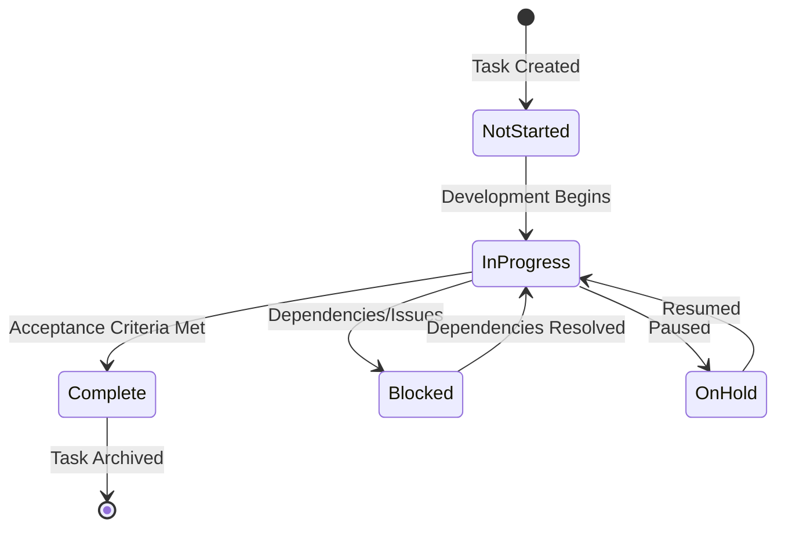

# Task Index - Hydroponic Monitor

> **Central registry of all tasks and their current status.**

## Task Management Overview

This folder contains individual task files following the format `TASKID-taskname.md`. Each task represents a discrete unit of work with clear acceptance criteria and status tracking.

### Task Status Definitions
- **🔴 Not Started**: Task identified but work has not begun
- **🟡 In Progress**: Active development underway  
- **🟢 Complete**: Task finished and acceptance criteria met
- **🔵 Blocked**: Task cannot proceed due to dependencies
- **⚪ On Hold**: Task paused pending decisions or resources

### Task Categories
- **ARCH**: Architecture and system design
- **FEAT**: New feature development  
- **DOC**: Documentation and knowledge management
- **TEST**: Testing and quality assurance
- **PERF**: Performance optimization
- **FIX**: Bug fixes and issue resolution
- **INFRA**: Infrastructure and deployment

## Active Tasks

### Template task

| ID | Task Name | Status | Owner | Due Date |
|---|---|---|---|---|
| DOC-001 | Memory Bank Documentation System | 🟡 In Progress | Development Team | 2025-09-06 |

## Task Templates

### New Task Creation
Use the following template when creating new tasks:

```markdown
# [TASKID] - [Task Name]

## Overview
Brief description of the task and its purpose.

## Acceptance Criteria
- [ ] Specific, measurable criteria for completion
- [ ] Each criteria should be testable
- [ ] Include any non-functional requirements

## Dependencies  
List any tasks or external dependencies that must be completed first.

## Estimated Effort
Time estimate for completion.

## Implementation Notes
Technical approach, considerations, and constraints.

## Testing Requirements
How this task will be tested and validated.

## Definition of Done
Clear criteria for when this task is complete.

---
*Created: [DATE]*
*Status: [STATUS]*
```

## Task Workflow

### Task Lifecycle


### Task Creation Process
1. **Identify Need**: Task identified during planning or development
2. **Create Task File**: Use template to create `TASKID-taskname.md`
3. **Update Index**: Add task to appropriate section in this index
4. **Assign Owner**: Assign task to team member or team
5. **Set Priority**: Determine priority and due date
6. **Begin Work**: Update status to In Progress when work begins

### Task Completion Process  
1. **Complete Acceptance Criteria**: Ensure all criteria met
2. **Update Task File**: Document completion and any notes
3. **Update Index**: Move task to completed section
4. **Archive if Needed**: Move old tasks to archive folder if necessary

## Reporting and Metrics

### Current Sprint Status
```yaml
Active Tasks: 3
In Progress: 1 (DOC-001)
Not Started: 0
Blocked: 0
On Hold: 0
```
### Quality Metrics
- **Acceptance Criteria Met**: 100% (all completed tasks)
- **Testing Coverage**: All tasks include testing requirements
- **Documentation Updated**: All tasks update relevant documentation
- **Code Quality**: All tasks maintain architecture and quality standards

## Task Categories Detail

### ARCH - Architecture Tasks
Focus on system design, patterns, and architectural decisions. These tasks typically have high impact and require careful planning and review.

### FEAT - Feature Tasks  
New functionality development. Include user-facing features and system capabilities. Require user acceptance criteria and testing.

### DOC - Documentation Tasks
Knowledge management, documentation updates, and process improvements. Critical for team coordination and project continuity.

### TEST - Testing Tasks
Quality assurance, test development, and testing infrastructure. Ensure system reliability and regression prevention.

### PERF - Performance Tasks
Optimization work for speed, memory usage, battery life, and system efficiency. Include benchmarking and measurement.

### FIX - Bug Fix Tasks
Issue resolution and system corrections. Include root cause analysis and prevention measures.

### INFRA - Infrastructure Tasks
Deployment, CI/CD, monitoring, and system administration tasks. Foundation for development and operations.

---

## Related Documents
- **← Active Context**: [../activeContext.md](../activeContext.md) - Current development focus
- **← Progress**: [../progress.md](../progress.md) - Overall project status
- **Task Files**: Individual task documentation in this folder

---
*Last Updated: 2025-09-06*