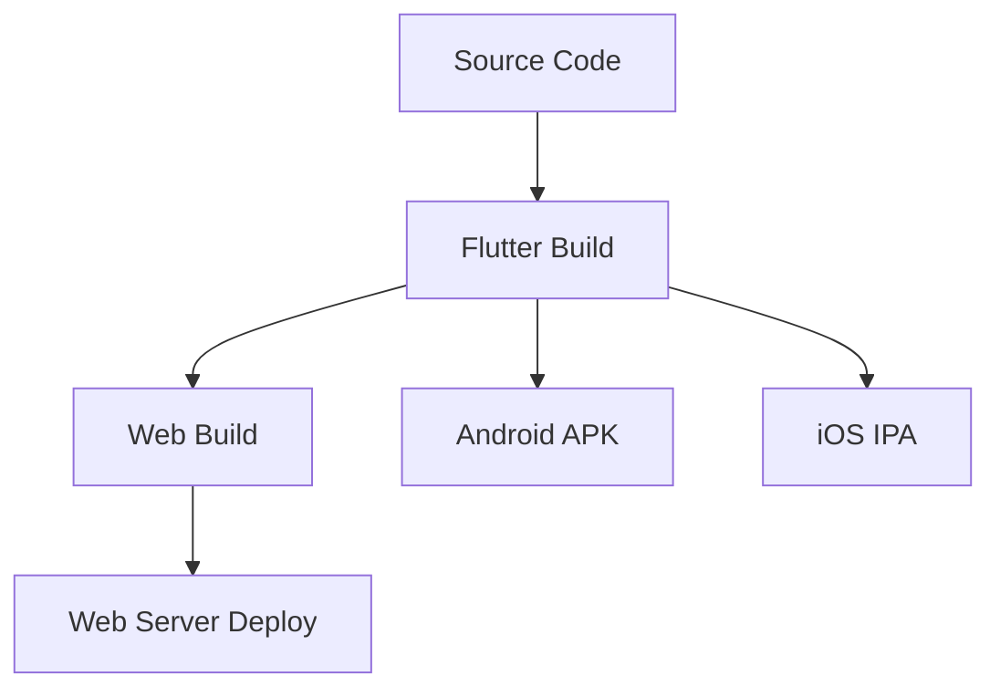
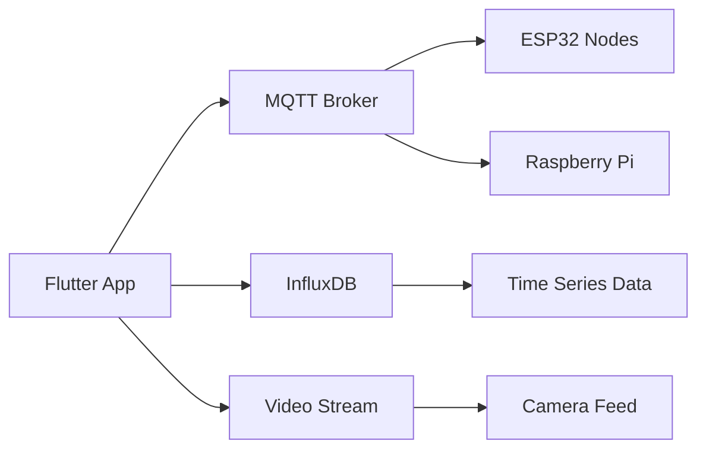

# Tech Context - Hydroponic Monitor

> **Technologies, setup, constraints, and dependencies.**

## Technology Stack

### Frontend Framework

#### Flutter 3.35.2+
- **Language**: Dart 3.9.0+
- **Rationale**: Cross-platform native performance with single codebase
- **Platforms**: Web (primary), Android, Windows
- **Architecture**: Widget-based reactive UI with hot reload

#### Key Flutter Features Used
- **Material 3 Design**: Modern adaptive theming
- **Platform Channels**: Native integration when needed
- **WebAssembly**: High performance web deployment
- **Hot Reload**: Rapid development iteration

### State Management

#### Riverpod (hooks_riverpod ^2.6.1)
- **Pattern**: Provider-based dependency injection and state management
- **Benefits**: Compile-time safety, testability, reactive programming
- **Features**: StateNotifier, StreamProvider, FutureProvider patterns
- **Testing**: Built-in mocking and testing utilities

### Navigation

#### go_router ^16.2.1
- **Pattern**: Declarative routing with type safety
- **Features**: Named routes, path parameters, guards
- **Deep Linking**: Web URL support and mobile deep links
- **State Integration**: Router state synchronized with app state

### Network & Data

#### MQTT Communication
- **Package**: mqtt_client ^10.11.0
- **Protocol**: MQTT 3.1.1 with TLS support
- **QoS**: Quality of service levels 0, 1, 2
- **Features**: Auto-reconnection, last will testament
- **Topics**: Structured namespacing (grow/{node}/{category})

#### HTTP Client
- **Primary**: dio ^5.7.0 for advanced HTTP features
- **Secondary**: http ^1.2.2 for simple requests
- **Features**: Interceptors, retries, timeout handling
- **Certificates**: Custom certificate support for self-signed

#### InfluxDB Time-Series
- **Package**: influxdb_client ^2.11.0
- **Version**: InfluxDB 2.x with Flux query language
- **Features**: Streaming queries, aggregation functions
- **Performance**: Optimized for time-series data patterns

### Data Modeling

#### Code Generation
- **Serialization**: json_annotation ^4.9.0 + json_serializable ^6.11.0
- **Immutability**: freezed ^3.2.0 for sealed classes and unions
- **Build System**: build_runner ^2.7.0 for code generation

#### Data Patterns
- **Entities**: Immutable domain models with freezed
- **DTOs**: JSON serializable data transfer objects  
- **Result Types**: Sealed classes for error handling
- **Streams**: Reactive data flow with StreamController

### UI & Visualization

#### Charts
- **Package**: fl_chart ^1.0.0
- **Types**: Line charts, bar charts, pie charts
- **Features**: Interactive touch handling, animations
- **Performance**: Efficient rendering for large datasets

#### Material Design
- **System**: Material 3 with dynamic theming
- **Components**: Standard Material widgets
- **Theming**: Color schemes, typography, spacing tokens
- **Accessibility**: Semantic labels and navigation

### Storage & Configuration

#### Secure Storage
- **Package**: flutter_secure_storage ^9.2.2
- **Use Cases**: MQTT credentials, InfluxDB tokens
- **Security**: Platform-native secure storage mechanisms

#### Environment Configuration
- **Package**: flutter_dotenv ^6.0.0
- **Files**: .env for development, dart-define for production
- **Security**: No secrets in source code or builds
- **Flexibility**: Different configs per environment

### Development Tools

#### Code Quality
- **Linting**: flutter_lints ^6.0.0 with strict analysis
- **Formatting**: dart format with consistent style
- **Analysis**: analysis_options.yaml with custom rules
- **CI/CD**: Automated quality checks on every PR

#### Testing Framework
- **Unit Tests**: Built-in flutter_test framework
- **Mocking**: mocktail ^1.0.4 for test doubles
- **Widget Tests**: Component testing with testWidgets
- **Integration Tests**: End-to-end testing with test driver

## Environment Setup

### Prerequisites

#### Development Environment
```yaml
Flutter SDK: 3.35.2+
Dart SDK: 3.9.0+ 
IDE: VS Code with Flutter extension (recommended)
Git: Version control
```

#### Platform Requirements
```yaml
Web: Modern browser with WebAssembly support
Android: Android SDK 21+ (Android 5.0+)
Windows: Windows 10+ with Visual Studio Build Tools
Linux: GTK 3.0+ development headers
```

#### Backend Dependencies
```yaml
MQTT Broker: Mosquitto or similar
InfluxDB: 2.x with Flux query support
Network: Local WiFi with internet connectivity
```

### Configuration Management

#### Environment Variables
```bash
# MQTT Configuration
MQTT_BROKER_URL=mqtt://192.168.1.100:1883
MQTT_USERNAME=hydroponic_app
MQTT_PASSWORD=secure_password
MQTT_TLS=true

# InfluxDB Configuration  
INFLUX_URL=http://192.168.1.100:8086
INFLUX_TOKEN=your_influxdb_token
INFLUX_ORG=hydroponic_org
INFLUX_BUCKET=sensor_data

# Video Stream
MJPEG_URL=http://192.168.1.101:8080/stream
```

#### Build Configuration
```bash
# Development build
flutter run -d web-server --web-port 8080

# Production build with dart-define
flutter build web --dart-define-from-file=dart_defines.json

# Android release
flutter build apk --release --dart-define-from-file=dart_defines.json
```

## Technical Constraints

### Performance Constraints

#### Memory Usage
- **Mobile Devices**: Optimize for 2GB+ RAM devices
- **Web Browsers**: Efficient memory management for long-running sessions

#### Network Bandwidth
- **MQTT Messages**: Efficient payload sizes < 1KB per message
- **Video Streams**: Adaptive quality based on connection speed
- **Historical Queries**: Pagination and data aggregation

#### Battery Life
- **Background Processing**: Minimize CPU usage when backgrounded
- **Network Efficiency**: Batch operations and connection pooling
- **Screen Updates**: Efficient widget rebuilding

### Platform Constraints

#### Web Platform
- **CORS**: Cross-origin restrictions for MQTT WebSocket connections
- **File System**: Limited local file access
- **Hardware**: No direct hardware sensor access
- **URLs**: Deep linking and routing considerations

#### Mobile Platforms
- **App Lifecycle**: Handle background/foreground transitions
- **Permissions**: Network access permissions
- **Storage**: Platform-specific secure storage limitations
- **Notifications**: Background notification capabilities


## Integration Constraints

### MQTT Protocol Limitations
- **Message Size**: 256MB theoretical, 64KB practical limit
- **QoS Overhead**: Higher QoS levels increase latency
- **Connection Limits**: Broker-dependent concurrent connections
- **Topic Restrictions**: Character set and length limitations

### InfluxDB Limitations
- **Query Complexity**: Flux query performance considerations
- **Data Volume**: Storage and query performance at scale
- **Connection Pooling**: Limited concurrent query connections
- **Retention Policies**: Automatic data lifecycle management

### Flutter Framework Limitations
- **Platform Differences**: Feature availability varies by platform
- **Plugin Compatibility**: Third-party plugin platform support
- **Performance**: Rendering performance on low-end devices
- **Memory**: Garbage collection impact on real-time updates

## Testing Infrastructure

### Automated Testing
```yaml
Unit Tests: 80+ tests covering business logic
Widget Tests: UI component testing
Integration Tests: 5+ end-to-end scenarios
```

### CI/CD Pipeline
```yaml
Quality Gates:
  - Code formatting (dart format)
  - Static analysis (flutter analyze)  
  - Unit tests (flutter test)
  - Build verification (web, android)
  - Integration tests (Docker compose)
```

### Test Environment
```yaml
Docker Services:
  - MQTT Broker (Mosquitto)
  - InfluxDB with test data
  - Mock video stream
  - Network simulation tools
```

## Deployment Architecture

### Build Targets


### Infrastructure Dependencies


---

## Related Documents
- **← Project Brief**: [projectbrief.md](./projectbrief.md) - Project scope and requirements
- **← System Patterns**: [systemPatterns.md](./systemPatterns.md) - Architecture patterns
- **→ Active Context**: [activeContext.md](./activeContext.md) - Current development status
- **→ Progress**: [progress.md](./progress.md) - Implementation roadmap

---
*Last Updated: 2025-09-06*