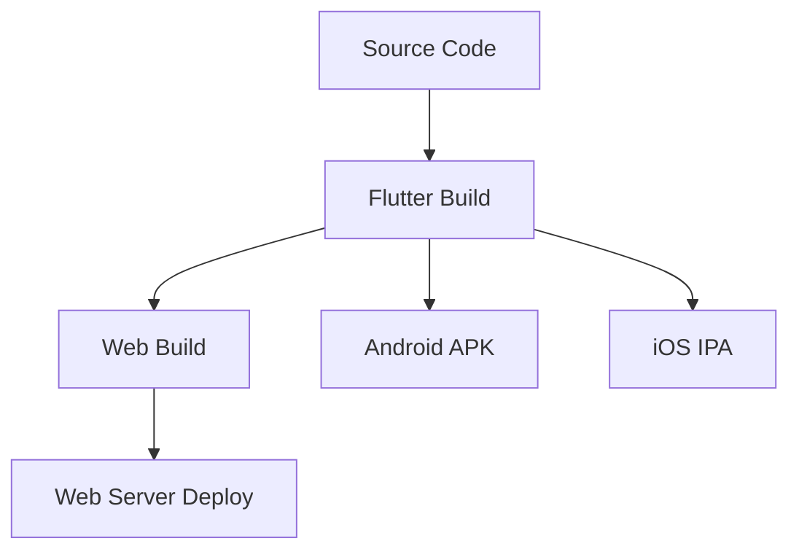
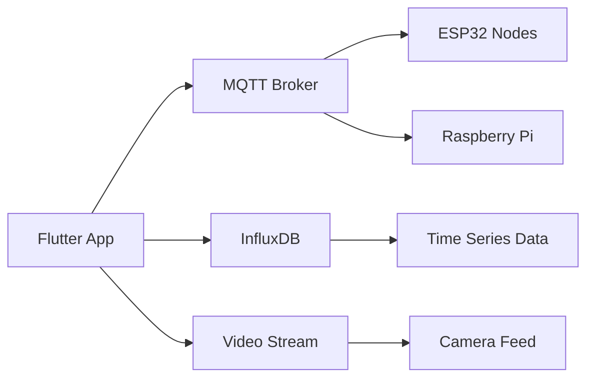

# Tech Context - Hydroponic Monitor

> **Technologies, setup, constraints, and dependencies.**

## Technology Stack

### Frontend Framework

#### Flutter 3.35.x (Dart 3.9)
- **Targets**: Web (primary), Android, desktop shells for validation
- **UI Stack**: Material 3 theming via custom spacing/typography tokens (`core/theme.dart`)
- **Routing**: `go_router` shell navigation with bottom navigation scaffold
- **State**: Riverpod-driven widgets (ConsumerWidget / ConsumerStatefulWidget) for fine-grained rebuilds

### State Management

#### Riverpod (hooks_riverpod ^2.6)
- **Providers**: `Provider` (services), `StateNotifierProvider` (VideoState, DeviceControls), `StreamProvider` (sensor data), `FutureProvider` (repository initialization)
- **Testability**: ProviderContainer harness + overrides used across test suite
- **Lifecycle**: AutoDispose for page-specific streams (video) to avoid background resource usage

### Navigation

#### go_router ^16
- Shell route hosts dashboard/devices/video/charts/settings tabs
- Bottom navigation -> `context.go()` transitions maintain URL for web deep links
- Future-proof for guarded routes (e.g., auth) via provider lookups

### Network & Data

#### MQTT
- **Package**: `mqtt_client` (server + browser implementations)
- **Usage**: `MqttService` handles connect/reconnect, topic subscriptions (`grow/{node}/sensor|actuator|device`), publishes commands, replays status cache for late subscribers.
- **Web Support**: Attempts `MqttBrowserClient` over WebSocket (`ws://host:9001`), falls back to TCP client for tests.

#### MJPEG Streaming
- **Native**: `dart:io` HttpClient parser with boundary scanning + resolution events
- **Web**: Fetch + ReadableStream via `package:web`, manual multipart parsing, AbortController for teardown
- **State**: `VideoStateNotifier` enforces 5s connection timeout, phase transitions, simulation fallback when `REAL_MJPEG=false`

#### Time-Series Data (InfluxDB)
- **Package**: `influxdb_client`
- **Service**: `InfluxDbService` writes via `Point` API, queries via Flux with dummy fallback when server not reachable (development/testing)
- **Planned**: Historical chart queries (range + aggregation) pending TASK TBD

#### HTTP / REST
- `http` and `dio` are available for ancillary REST calls; currently unused in production flows (reserved for future modules).

### Data Modeling

- **Domain Entities**: Hand-authored immutable classes (`SensorData`, `Device`) in `domain/entities`
- **Result Types**: Lightweight `Result` sealed classes (`Success`, `Failure`) defined in `core/errors.dart`
- **Streams**: StreamControllers within services (MQTT sensor/device streams) with replay buffers for device status
- **Codegen**: `json_serializable` / `freezed` dependencies available but not yet leveraged (future-proofing)

### UI & Visualization

- **Charts**: `ChartsPage` currently hosts time-range chip selector + placeholder; fl_chart integration planned alongside historical data task.
- **Dashboards**: Sensor tiles show live readings with fallback copy (“Waiting…”, “No Data”); Device cards provide toggles/sliders with pending indicators.
- **Status Indicators**: `StatusBadge`, `ConnectionNotification` reflect provider health signals.
- **Accessibility**: Copy-driven phases for video page improve screen reader clarity.

### Storage & Configuration

- **Environment**: `flutter_dotenv` + OS environment variables (prefers OS for non-web) configured via `Env` helper (MQTT, Influx, MJPEG feature flag).
- **Secure Storage**: `flutter_secure_storage` dependency available for future secrets (not yet in active use).

### Development Tools

#### Code Quality
- **Linting**: flutter_lints ^6.0.0 with strict analysis
- **Formatting**: dart format with consistent style
- **Analysis**: analysis_options.yaml with custom rules
- **CI/CD**: Automated quality checks on every PR

#### Testing Framework
- **Unit Tests**: Built-in flutter_test framework
- **Mocking**: mocktail ^1.0.4 for test doubles
- **Widget Tests**: Component testing with testWidgets
- **Integration Tests**: End-to-end testing with test driver

## Environment Setup

### Prerequisites

#### Development Environment
```yaml
Flutter SDK: 3.35.2+
Dart SDK: 3.9.0+ 
IDE: VS Code with Flutter extension (recommended)
Git: Version control
```

#### Platform Requirements
```yaml
Web: Modern browser with WebAssembly support
Android: Android SDK 21+ (Android 5.0+)
Windows: Windows 10+ with Visual Studio Build Tools
Linux: GTK 3.0+ development headers
```

#### Backend Dependencies
```yaml
MQTT Broker: Mosquitto or similar
InfluxDB: 2.x with Flux query support
Network: Local WiFi with internet connectivity
```

### Configuration Management

#### Environment Variables
```bash
# MQTT Configuration
MQTT_BROKER_URL=mqtt://192.168.1.100:1883
MQTT_USERNAME=hydroponic_app
MQTT_PASSWORD=secure_password
MQTT_TLS=true

# InfluxDB Configuration  
INFLUX_URL=http://192.168.1.100:8086
INFLUX_TOKEN=your_influxdb_token
INFLUX_ORG=hydroponic_org
INFLUX_BUCKET=sensor_data

# Video Stream
MJPEG_URL=http://192.168.1.101:8080/stream
```

#### Build Configuration
```bash
# Development build
flutter run -d web-server --web-port 8080

# Production build with dart-define
flutter build web --dart-define-from-file=dart_defines.json

# Android release
flutter build apk --release --dart-define-from-file=dart_defines.json
```

## Technical Constraints

### Platform Constraints

#### Web Platform
- **CORS**: Cross-origin restrictions for MQTT WebSocket connections
- **File System**: Limited local file access
- **Hardware**: No direct hardware sensor access
- **URLs**: Deep linking and routing considerations

#### Mobile Platforms
- **App Lifecycle**: Handle background/foreground transitions
- **Permissions**: Network access permissions
- **Storage**: Platform-specific secure storage limitations
- **Notifications**: Background notification capabilities

### Testing Infrastructure

#### Automated Testing
- `scripts/test-runner.sh` orchestrates unit (`flutter test --exclude-tags=integration`) and Docker-backed integration suites (`--tags=integration`).
- Unit/provider tests cover MQTT parsing, repositories, providers, and video state transitions.
- Integration tests validate MQTT publish/confirm flows, video notifier behavior, and environment configuration fallback.
- Widget tests exercise key UI states (VideoPage, DevicesPage, connection notifications).

#### CI/CD
- GitHub Actions pipeline (formatting, analysis, tests) ensures quality gates prior to merge.
- Integration suite optional due to Docker dependencies (manual trigger recommended before release).

#### Test Environment
- Docker Compose stack (Mosquitto, InfluxDB, Telegraf, optional fake MJPEG server) under `test/integration/`.
- Test utilities include `test/test_utils/fake_mjpeg_server.dart` for deterministic MJPEG parsing tests.

### Testing Procedure
For complete testing instructions, procedures, and troubleshooting, see the **[Testing Procedure](./testing-procedure.md)** document.

## Deployment Architecture

### Build Targets


### Infrastructure Dependencies


---

## Related Documents
- **← Project Brief**: [projectbrief.md](./projectbrief.md) - Project scope and requirements
- **← System Patterns**: [systemPatterns.md](./systemPatterns.md) - Architecture patterns
- **→ Testing Procedure**: [testing-procedure.md](./testing-procedure.md) - Complete testing guide
- **→ Active Context**: [activeContext.md](./activeContext.md) - Current development status
- **→ Progress**: [progress.md](./progress.md) - Implementation roadmap

---
*Last Updated: 2025-09-24*