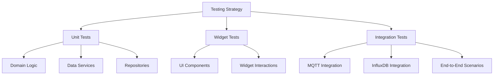

# Testing Procedure - Hydroponic Monitor

> **Comprehensive testing guide covering all test types, setup, execution, and results analysis.**

## Overview

The Hydroponic Monitor uses a multi-layered testing strategy to ensure reliability and maintainability. This document provides step-by-step procedures for running all tests and examining results.

## Test Architecture



## Test Categories

### Unit Tests (70+ tests)
- **Domain entities**: Device, SensorData models
- **Data services**: MQTT service, InfluxDB service 
- **Repositories**: Sensor data repositories
- **Business logic**: Data generation, error handling
- **Utilities**: Test helpers and mocks

### Widget Tests
- **UI components**: Connection notifications, status indicators
- **User interactions**: Button presses, form inputs
- **State changes**: Widget rebuilds, theme changes

### Integration Tests (5+ scenarios)
- **MQTT provider integration**: Real broker connections
- **Database integration**: InfluxDB queries and writes
- **End-to-end flows**: Complete data pipeline testing
- **Service integration**: Multiple service interactions

## Prerequisites

### Required Software
```bash
# Core requirements
flutter --version    # Flutter 3.35+ required
dart --version       # Dart 3.9+ required

# Integration test requirements  
docker --version     # Docker for test services
docker compose version  # Docker Compose v2+

# Optional for coverage reports
lcov --version       # LCOV for HTML coverage reports
```

### Environment Setup
```bash
# 1. Install dependencies
flutter pub get

# 2. Verify Flutter configuration
flutter doctor

# 3. Make test scripts executable (if needed)
chmod +x scripts/test-runner.sh
chmod +x scripts/run-integration-tests.sh
```

## Running Tests

### Quick Test Commands

#### Unit Tests Only (Default)
```bash
# Basic unit test run
./scripts/test-runner.sh

# Equivalent Flutter command
flutter test --exclude-tags=integration
```

#### Unit Tests with Coverage
```bash
# Generate coverage report
./scripts/test-runner.sh --coverage

# View HTML coverage report (if lcov installed)
open coverage/html/index.html
```

#### Integration Tests Only
```bash
# Start services and run integration tests
./scripts/test-runner.sh --integration

# Alternative: Use dedicated integration runner
./scripts/run-integration-tests.sh
```

#### All Tests (Unit + Integration)
```bash
# Run complete test suite
./scripts/test-runner.sh --all
```

### Detailed Test Procedures

#### 1. Unit Tests

**Purpose**: Validate individual components and business logic

**Steps**:
1. Ensure dependencies are installed: `flutter pub get`
2. Run unit tests: `./scripts/test-runner.sh --unit`
3. Review test output for failures
4. Check coverage (optional): `./scripts/test-runner.sh --unit --coverage`

**Expected Results**:
- ✅ 67+ tests should pass
- ❌ 0-1 integration tests may fail (expected without services)
- 📊 Coverage should be >80% for core business logic

**Test Files Covered**:
```
test/unit/mqtt_data_generation_test.dart
test/domain/entities/device_test.dart
test/domain/entities/sensor_data_test.dart
test/data/repos/sensor_repository_test.dart
test/data/error_handling_test.dart
test/data/influx/influx_service_test.dart
test/data/mqtt/mqtt_service_test.dart
```

#### 2. Widget Tests

**Purpose**: Validate UI components and user interactions

**Steps**:
1. Run widget tests: `flutter test test/presentation/`
2. Verify UI components render correctly
3. Test user interaction flows

**Expected Results**:
- ✅ All widget tests pass
- 🖼️ Widgets render without errors
- 🔄 State changes work correctly

**Test Files Covered**:
```
test/presentation/widgets/connection_notification_test.dart
test/widget_test.dart
```

#### 3. Integration Tests

**Purpose**: Test complete system integration with external services

**Prerequisites**:
- Docker and Docker Compose installed
- Available ports: 1883 (MQTT), 8086 (InfluxDB), 8080 (Web UI)
- Internet connection for downloading Docker images

**Steps**:

**Option A: Using test-runner.sh**
```bash
# Start services and run integration tests
./scripts/test-runner.sh --integration

# Keep services running for debugging
./scripts/test-runner.sh --integration --verbose
```

**Option B: Using dedicated integration runner**
```bash
# Run with automatic cleanup
./scripts/run-integration-tests.sh

# Keep services running after tests
./scripts/run-integration-tests.sh --keep-services
```

**Manual Step-by-Step**:
```bash
# 1. Start test services
cd test/integration
docker compose up -d

# 2. Wait for services to be healthy (5-10 minutes)
docker compose ps  # Check status

# 3. Run integration tests from project root
cd ../..
flutter test test/integration/ --reporter=expanded

# 4. Stop services when done
cd test/integration
docker compose down
```

**Expected Results**:
- 🐳 Docker services start successfully
- ✅ Services become healthy (mosquitto, influxdb)
- ✅ 5+ integration tests pass
- 📊 End-to-end data flows work correctly

**Service Validation**:
```bash
# Check service health
docker compose ps

# View service logs if needed
docker compose logs mosquitto
docker compose logs influxdb

# Test MQTT connection manually (optional)
mosquitto_pub -h localhost -p 1883 -t "test/topic" -m "test message"
```

## Test Results Analysis

### Understanding Test Output

#### Successful Test Run
```
🧪 Hydroponic Monitor Test Suite
📦 Getting dependencies...
✅ Dependencies resolved
🔬 Running unit tests...
✅ Unit tests passed
📊 Coverage reports generated
🎉 Test run completed!
```

#### Test Failure Analysis
```
❌ Unit tests failed

::error::67 tests passed, 1 failed.

Failed tests:
/path/to/failing_test.dart: Test Name
  Expected: true
  Actual: false
```

### Coverage Report Analysis

When running with `--coverage`, coverage reports are generated:

**Files Generated**:
```
coverage/lcov.info           # Raw LCOV data
coverage/lcov_filtered.info  # Filtered (excludes generated files)
coverage/html/index.html     # HTML report (if lcov installed)
```

**Coverage Thresholds**:
- **Excellent**: >90% line coverage
- **Good**: 80-90% line coverage  
- **Acceptable**: 70-80% line coverage
- **Needs Improvement**: <70% line coverage

**Excluded from Coverage**:
- Generated files (`*.g.dart`, `*.freezed.dart`)
- Generated code (`lib/generated/*`)

### Integration Test Service Monitoring

#### Service Health Checks
```bash
# Check all services
docker compose ps

# Service-specific health
curl http://localhost:8086/health  # InfluxDB
mosquitto_pub -h localhost -p 1883 -t "health/check" -m "test"  # MQTT
```

#### Log Analysis
```bash
# View recent logs
docker compose logs --tail=50

# Follow logs in real-time
docker compose logs -f

# Service-specific logs
docker compose logs mosquitto
docker compose logs influxdb
```

## Troubleshooting

### Common Issues

#### "Docker not found" Error
```bash
# Install Docker
curl -fsSL https://get.docker.com -o get-docker.sh
sh get-docker.sh

# Add user to docker group (Linux)
sudo usermod -aG docker $USER
newgrp docker
```

#### "Port already in use" Error
```bash
# Find process using port
lsof -i :1883  # MQTT
lsof -i :8086  # InfluxDB

# Stop existing services
docker compose down
docker system prune -f
```

#### "Services not healthy" Error
```bash
# Check service logs
docker compose logs

# Restart services
docker compose down
docker compose up -d

# Wait longer for services to initialize
sleep 60
```

#### Unit Tests Failing
```bash
# Clean and reinstall dependencies
flutter clean
flutter pub get

# Run with verbose output
flutter test --reporter=expanded

# Run specific failing test
flutter test test/path/to/failing_test.dart
```

### Performance Optimization

#### Faster Test Runs
```bash
# Run tests in parallel (unit tests only)
flutter test --concurrency=4

# Skip slow integration tests during development
./scripts/test-runner.sh --unit

# Use test name patterns
flutter test --name="specific test pattern"
```

#### Docker Optimization
```bash
# Pre-pull images
docker compose pull

# Use Docker BuildKit for faster builds
export DOCKER_BUILDKIT=1

# Clean up after tests
docker system prune -f
```

## Continuous Integration

### GitHub Actions Integration

The project includes automated testing via GitHub Actions:

**Triggers**:
- Pull requests to main branch
- Push to main branch
- Manual workflow dispatch

**Quality Gates**:
1. **Code Formatting**: `dart format --set-exit-if-changed .`
2. **Static Analysis**: `flutter analyze`
3. **Unit Tests**: `flutter test --exclude-tags=integration`
4. **Build Verification**: `flutter build web` and `flutter build apk`
5. **Integration Tests**: Docker-based integration test suite

### Local CI Simulation
```bash
# Run all quality gates locally
dart format --set-exit-if-changed .
flutter analyze
./scripts/test-runner.sh --all --coverage
flutter build web
```

## Best Practices

### Test Writing Guidelines
1. **Follow AAA Pattern**: Arrange, Act, Assert
2. **Use Descriptive Names**: Test names should explain what's being tested
3. **Mock External Dependencies**: Use `mocktail` for reliable unit tests
4. **Test Edge Cases**: Include boundary conditions and error scenarios
5. **Keep Tests Independent**: Each test should be able to run in isolation

### Test Organization
1. **Group Related Tests**: Use `group()` to organize test suites
2. **Use Setup/Teardown**: Clean setup and teardown for each test
3. **Separate Unit/Integration**: Clear separation between test types
4. **Document Complex Tests**: Add comments for complex test scenarios

### Performance Considerations
1. **Minimize External Calls**: Mock services for unit tests
2. **Clean Up Resources**: Properly dispose of streams and controllers
3. **Use Test Utilities**: Leverage shared test helpers and fixtures
4. **Parallel Execution**: Design tests to run concurrently when possible

---

## Related Documents

- **← Tech Context**: [techContext.md](./techContext.md) - Testing infrastructure details
- **← System Patterns**: [systemPatterns.md](./systemPatterns.md) - Architecture patterns
- **→ Progress**: [progress.md](./progress.md) - Testing implementation status

---

*Last Updated: 2025-09-06*
*Test Suite Version: 1.0*
*Coverage Target: >80%*